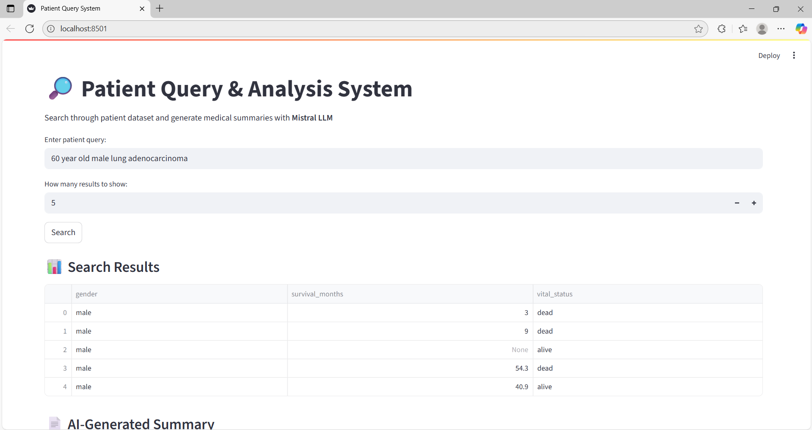

# Clinical Data Retrieval and Summarization using RAG

## Overview
This project implements a Retrieval-Augmented Generation (RAG) pipeline for querying clinical data. It allows users to retrieve patient records relevant to a natural language query and generates a concise, context-aware summary using a local language model. The solution combines vector search with LLM-based summarization and is deployed with a Streamlit-based web interface.

## Objectives
- Build an end-to-end retrieval and summarization pipeline for clinical datasets.  
- Enable natural language queries over patient records.  
- Generate human-readable summaries of retrieved results using a local LLM.  
- Provide a Streamlit application for professional presentation.  

## Dataset
The dataset consists of anonymized patient information with clinical and demographic attributes. It is used to generate embeddings for semantic search and context retrieval.

Examples of attributes used:  
- Age  
- Gender  
- Cancer type  
- Survival months 
- Treatment details  

## Tech Stack
- Languages and Libraries: Python, pandas, faiss, sentence-transformers  
- Embeddings: all-MiniLM-L6-v2 (via sentence-transformers)  
- Vector Database: FAISS  
- LLM Backend: Ollama (Mistral model running locally)  
- Frontend: Streamlit  
- Utilities: query_summary.txt for saving generated summaries  

## Key Features
- Preprocessed dataset converted into dense vector embeddings for similarity search.  
- Natural language query interface to fetch most relevant patient records.  
- Local LLM integration for generating structured summaries.  
- CLI and Streamlit-based interfaces for demonstration.  
- Summaries stored in text format for reproducibility.

## Screenshots

### CLI Query Mode



## Setup Instructions
1. Clone the repository:
    ```bash
    git clone https://github.com//22ad085/RAG-Based-Clinical-Data-Retrieval-and-Summarization-System-.git
    ```
2. Navigate to the project directory:
    ```bash
    cd /22ad085/RAG-Based-Clinical-Data-Retrieval-and-Summarization-System-
    ```
3. Run the CLI pipeline:
    ```bash
    python main.py
4.Run the Streamlit interface:
    ```bash
    streamlit run streamlit_app.py
# Query and Summarization Flow

1. A natural language query is entered (e.g., "pediatric glioblastoma patients").
2. The query is embedded and compared against patient embeddings using FAISS.
3. The top-N most similar records are retrieved.
4. A local LLM (Mistral via Ollama) generates a structured summary of the findings.
5. The generated summary is saved to `query_summary.txt`.

## Expected Outcomes

- A functional RAG pipeline demonstrating semantic search on clinical data.
- Structured summaries providing quick insights from retrieved records.
- Professional Streamlit interface for academic and technical evaluation.
- Reusable workflow for healthcare-related retrieval and summarization tasks.

## Contributors

- Karthika Lakshmi (Ramco Institute of Technology)

## License

This project is licensed under the MIT License – see the `LICENSE` file for details.

